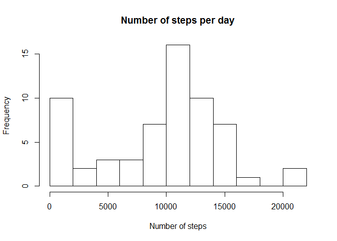
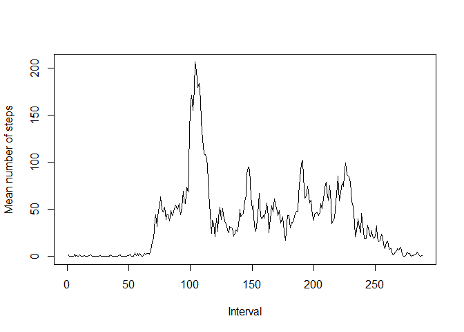
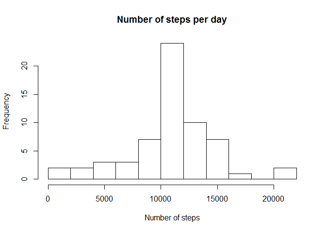

# Reproducible Research: Peer Assessment 1


## Loading and preprocessing the data

```r
Sys.setlocale(category = "LC_ALL",locale = "C")
```

```
## [1] "C"
```

```r
activity<-read.csv(file = "activity.csv",colClasses=c("integer","Date","integer"))
summary(activity)
```

```
##      steps             date               interval     
##  Min.   :  0.00   Min.   :2012-10-01   Min.   :   0.0  
##  1st Qu.:  0.00   1st Qu.:2012-10-16   1st Qu.: 588.8  
##  Median :  0.00   Median :2012-10-31   Median :1177.5  
##  Mean   : 37.38   Mean   :2012-10-31   Mean   :1177.5  
##  3rd Qu.: 12.00   3rd Qu.:2012-11-15   3rd Qu.:1766.2  
##  Max.   :806.00   Max.   :2012-11-30   Max.   :2355.0  
##  NA's   :2304
```

## What is mean total number of steps taken per day?

```r
hist(tapply(activity$steps,activity$date,sum,na.rm=TRUE),main = "Number of steps per day",xlab = "Number of steps",breaks = 10)
```

 
Mean and median

```r
mean(tapply(activity$steps,activity$date,sum,na.rm=TRUE))
```

```
## [1] 9354.23
```

```r
median(tapply(activity$steps,activity$date,sum,na.rm=TRUE))
```

```
## [1] 10395
```


## What is the average daily activity pattern?

```r
plot(tapply(activity$steps,activity$interval,mean,na.rm=TRUE),type="l",xlab="Interval",ylab="Mean number of steps")
```

 

Interval with most steps on average

```r
names(which.max(tapply(activity$steps,activity$interval,mean,na.rm=TRUE)))
```

```
## [1] "835"
```


## Imputing missing values
Number of missing values

```r
sum(is.na(activity))
```

```
## [1] 2304
```
Replacing missing values with the mean number of steps during that interval over all dates.

```r
meanstep<-tapply(activity$steps,activity$interval,mean,na.rm=TRUE)
meanstep<-array(meanstep,dim = nrow(activity))
meanstep<-meanstep[is.na(activity)]
activity$steps<-replace(activity$steps,which(is.na(activity$steps)),meanstep)
hist(tapply(activity$steps,activity$date,sum,na.rm=TRUE),main = "Number of steps per day",xlab = "Number of steps",breaks = 10)
```

 

Mean and median after replacing missing values

```r
mean(tapply(activity$steps,activity$date,sum))
```

```
## [1] 10766.19
```

```r
median(tapply(activity$steps,activity$date,sum))
```

```
## [1] 10766.19
```
The number of steps taken each day is much more even after inserting missing values.

## Are there differences in activity patterns between weekdays and weekends?

```r
library(lattice)
activity$weekdays<-ifelse(weekdays(activity$date) %in% c('Saturday','Sunday'),"weekend","weekday")
aggActivity<-aggregate(steps~interval*weekdays,activity,mean)
xyplot(steps~interval|weekdays,aggActivity,type="l",layout=c(1,2))
```

 

We see that there is a higher number of steps in the morning during weekdays.
